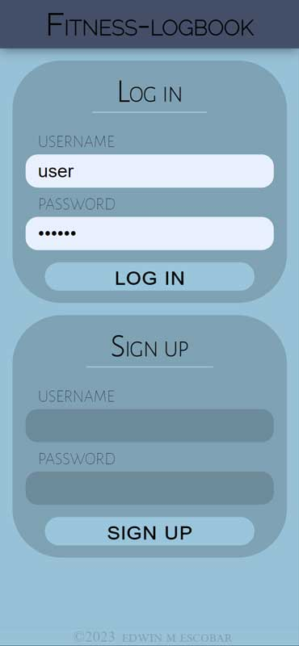
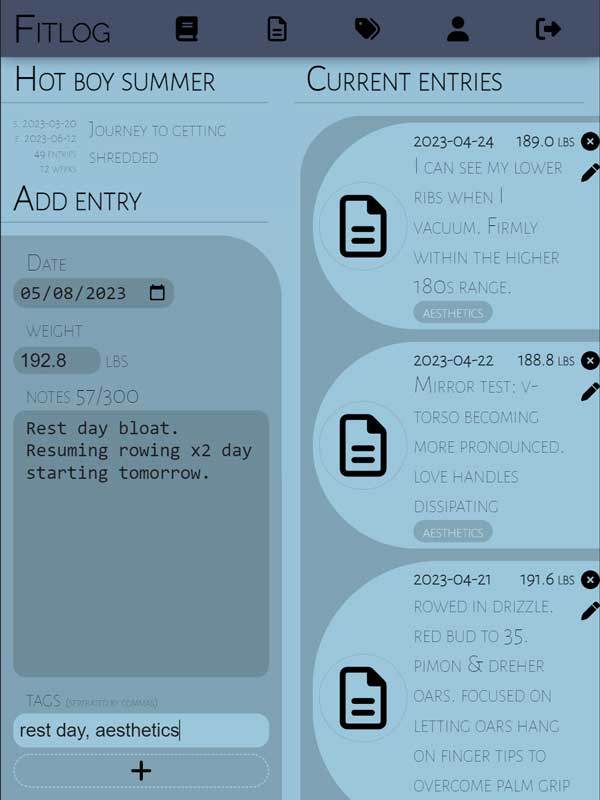
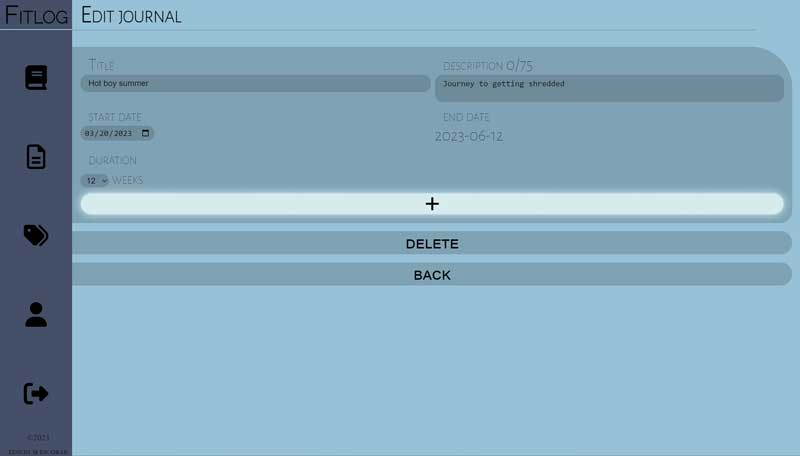

# fitness-logbook
  [Repository](https://github.com/escowin/fitness-logbook)
  
## Description
  This is a full-stack Node.js application that logs fitness-related observations and follows the Model-View-Controller (MVC) architecture. As an individual who is into rowing and is currently experiencing the first regatta season, I needed a platform to record my observations as I experiment with various exercise routines and diet plans. I decided to create a bespoke app that would not only make my life easier but would also help me display my technical expertise.

  To optimize the app's performance, I focused on maintaining a modularized and well-organized codebase throughout the development process. I avoided redundancies and modularized the code whenever possible to allow file sharing and enhance the application's efficiency. The directory structure of the app, util helpers, view partials, and frontend stylesheets and scripts are the outcome of this approach.

  To ensure the app's security, I utilized several npm libraries, regular expressions, and custom helpers. The environmental variables, Object-Relational Mapping (ORM) model schemas, password hashing, user sessions, auth-guarded routing, conditional rendering, and input parameters are some of the measures I employed to secure the data. 
  
  To enhance the user experience, the application utilizes CSS classes & variables, media queries, and view-specific stylesheets to ensure a visually appealing interface. Custom helpers have also been implemented to format data and render pluralization, improving the overall readability of the application.

  Going forward, I plan to continue improving the application's performance, enhancing its security features, and implementing new functionality while maintaining its SQL database and MVC architecture.
  
  The end product is now I have an app to journal my fitness experiments. I now know a lot more about SQL, routing, and data validation than when I had started.

## Table of Contents
  * [Installation](#installation)
  * [Usage](#usage)
  * [Credits](#credits)
  * [Test](#test)
  * [Author](#author)

## Installation
  Open the terminal and run the following commands.

  Download the respository:

    $ git clone git@github.com:escowin/fitness-logbook.git; 

  Navigate to root directory:

    $ cd fitness-logbook;

  Install the dependencies:

    $ npm i; 

  Rename root directory `.env.example` to `.env`. Modify the example variables values inside `.env` to user-specific credentials. 

  Start the server:

    $ npm start;

## Usage
  Open http://localhost:3001/ in browser. Login or sign up (first time user). Once logged in, users use menu links to navigate. Users can view, add, update, and delete journals, entries, and tags. Users are also able to log out of session. 

  
  
  

## Credits
  [bcrypt](https://github.com/kelektiv/node.bcrypt.js#readme), [connect-session-sequelize](https://github.com/mweibel/connect-session-sequelize), [dotenv](https://github.com/motdotla/dotenv#readme), [express](http://expressjs.com/), [express-handlebars](https://github.com/express-handlebars/express-handlebars), [express-session](https://www.npmjs.com/package/express-session), [jest](https://jestjs.io/), [mysql2](https://github.com/sidorares/node-mysql2#readme), [sequelize](https://sequelize.org/)

## License
  none

## Test
  Run the following command to run tests:
  ```
  $ npm test
  ```

## Author
  Edwin M. Escobar
  * [Email](mailto:edwin@escowinart.com)
  * [GitHub](https://github.com/escowin)
