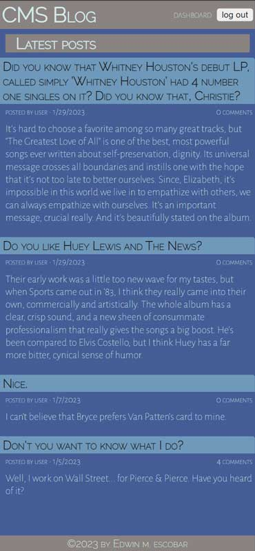
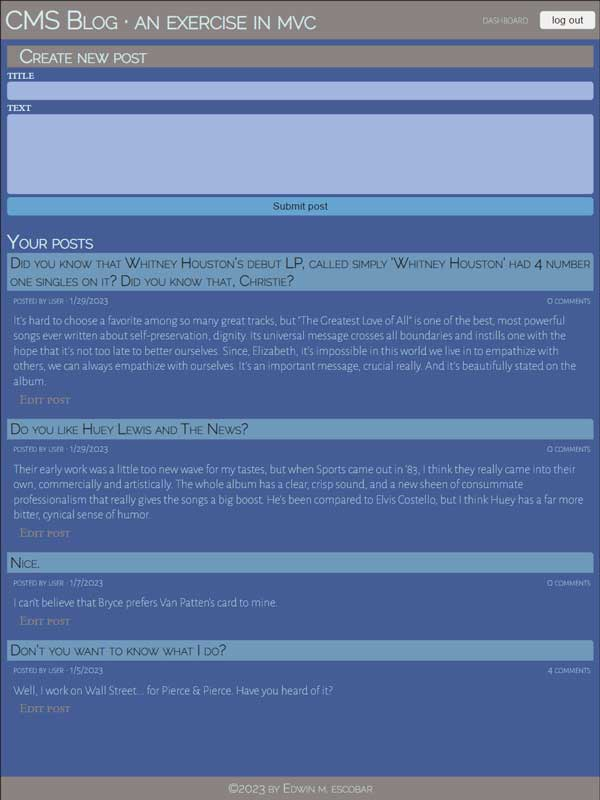
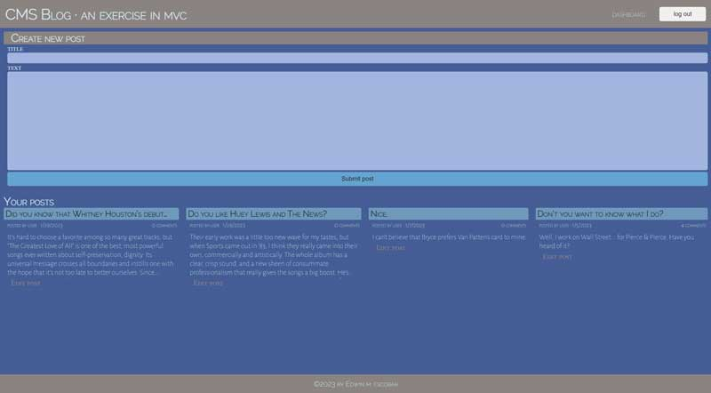

# fitness-logbook

  * [Repo](https://github.com/escowin/fitness-logbook)
  
  
## Description

  Logs fitness-related observations & data using the MVC architectural pattern.

## Table of Contents
  * [Languages](#languages)

  * [Libraries](#libraries)

  * [Installation](#installation)

  * [Usage](#usage)

  * [Test](#test)

  * [Screenshots](#screenshots)

  * [Author](#author)

## Languages

  CSS, JavaScript, SQL

## Libraries
  Handlebars, jest, Sequelize, sessions, bcrypt

## Requirements
  Node.js, mySQL

## Installation
Terminal instructions

  1. Navigate to desired download directory
  2. Run the following commands:

      ```
      $ git clone git@github.com:escowin/fitness-logbook.git; 
      ```
      ```
      $ cd fintess-logbook;
      ```
      ```
      $ npm i; 
      ```
      ```
      $ npm run seed;
      ```
      ```
      $ npm start;
      ```
  3. Open http://localhost:3001 in browser.

## Usage

  Personal use project

## Test
  
  Run the following command to run tests:
  ```
  npm test
  ```

## Screenshots





## Author

  Edwin M. Escobar

  * [Email](mailto:edwin@escowinart.com)

  * [GitHub](https://github.com/escowin)
